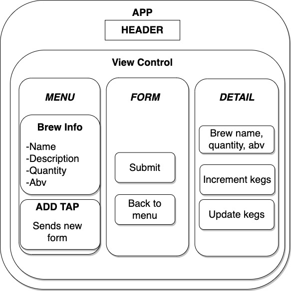

# _Uncle Dyl's Speakeasy_

#### By _Dylan Allison-Damitz_

***

## Description

Welcome to Uncle Dyl's Speakeasy! Come and stay awhile! This is a simple React application allowing users to create, read, update, and delete new keg types within the Speakeasy application. Users can restock kegs as they come in using the increment functionality, or decrease the keg supply as they are sold. A user can see, in real time, the amount of keg availability for each brew type. Prost! 

    
<strong>Expand to Read User Stories</strong>

1. As a user, I want to see a list/menu of all available kegs. For each keg, I want to see its name, brand, price and alcoholContent (or perhaps something like flavor for a kombucha store).
2. As a user, I want to submit a form to add a new keg to a list.
3. As a user, I want to be able to click on a keg to see its detail page.
4. As a user, I want to see how many pints are left in a keg. Hint: A full keg has roughly 124 pints.
5. As a user, I want to be able to click a button next to a keg whenever I sell a pint of it. This should decrease the number of pints left by 1. Pints should not be able to go below 0.

## Setup/Installation Requirements

    
Required Programs

    
1. An internet browser.
2. Visual Code Studio (or another code editor).
3. .NET

    
Installation of Program and Startup

1. Open the terminal on your local machine and navigate to "Desktop."
2. Clone Tap Room with the following git command `git clone https://github.com/Dylan-Allison-Damitz/tap-room.git`
3. Navigate to the top level of the repository with the command `cd tap-room`
4. In the CL, type in `npm install`.
5. In the CL, type in `npm run build`.
6. In the CL, type in `npm start`.

## Technologies Used
1. VSCode, Github
2. HTML, CSS, JS, MD, JSX
3. React, Webpack
4. .NET

## Known Bugs

_There are currently no known bugs._

## License :clipboard:
MIT &copy; 2021 _Dylan Allison-Damitz_
## Contact Information :mailbox:

_Dylan Allison-Damitz:
dylandamitz@gmail.com_